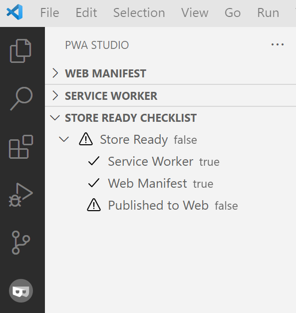

# Audit and package your PWA to distribute to app stores

In this step, we will audit the PWA to make sure it is installable and ready for publishing. We will also package the PWA to make it ready for distribution to app stores.

## Audit with PWA Studio

You can do this directly in VSCode with the PWA Studio extension. Navigate to the extension pane and checkout each section - web manifest, service worker, and store ready checklist. It looks like this:

You can also perform the audit through other tools such as [PWABuilder](https://microsoft.github.io/win-student-devs/#/30DaysOfPWA/dev-tools/05?id=audit-with-pwabuilder) and [Lighthouse in Edge dev tools](https://microsoft.github.io/win-student-devs/#/30DaysOfPWA/dev-tools/05?id=audit-performance-with-lighthouse-and-devtools).

## Package your PWA

