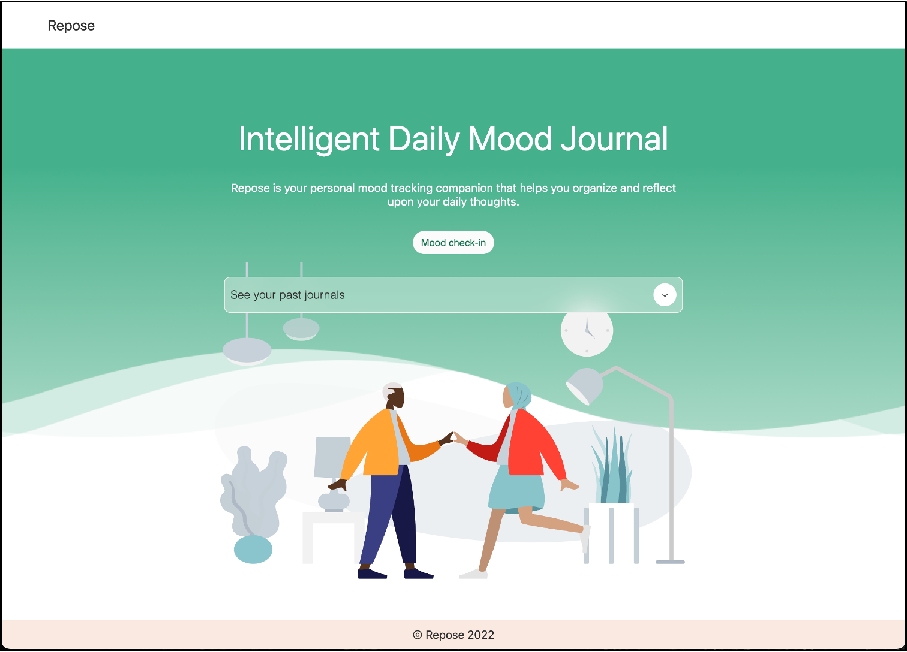

# Build A Progressively Enhanced Mood Journal Web App

## Overview
Have you heard about Progressive Web Apps (PWA) in the latest web development trends? Do you want to build web apps that can be installed across different platforms, be network-independent, work offline, and take advantage of platform-specific capabilities such as notifications? In this workshop, we will take you through the journey from how to get started building a Progressive Web App to deploying it to the Microsoft Store. 🧠

## Goals

| **Goal** | *Build an awesome progressively enhanced mood journal web app* |
| -------- | -------------------------------------------------------------- |
| **What will you learn** | Build, audit, and package your first Progressive Web App |
| **What you'll need** | A modern web browser like [Microsoft Edge](https://www.microsoft.com/edge). A code editor such as [Visual Studio Code](https://code.visualstudio.com/). [Git](https://git-scm.com/downloads). [Node.js](https://nodejs.org/en/). |
| **Duration** | 1 - 1.5 hours |
| **Microsoft Cloud Topics taught** | Azure Static Web Apps |
| **Just want to try the app or see the solution?** | *// TODO: link to azure static web and/or solution folder* |
| **Slides** | *// TODO: [Powerpoint](slides.pptx)* |
| **Author** | [Beth Pan](https://twitter.com/beth_panx) |

## Video

// TODO: Add a video
Embed your Train the Trainer video here. Instructions on how to create a great video experience is [available on this page](../video-guidance.md).

## Prerequisites

- Basic knowledge of HTML, CSS, and JavaScript. // TODO: link to web development resources. e.g. https://github.com/microsoft/workshop-library/tree/main/full/build-resume-website
- A modern web browser like [Microsoft Edge](https://www.microsoft.com/edge). PWAs are supported on most modern browsers but to facilitate this workshop we will be using [Microsoft Edge](https://www.microsoft.com/edge).
- A code editor such as [Visual Studio Code](https://code.visualstudio.com/).
- An [Azure account](https://azure.microsoft.com/free/students/) if you want to deploy your app to a secure endpoint.
- [Git](https://git-scm.com/downloads) to clone sample solutions.
- [Node.js](https://nodejs.org/en/) to run the sample solutions.

## What students will learn

By the end of this workshop, you will create a mood journal web app that can be installed across different platforms, be network-independent, work offline, and take advantage of platform-specific capabilities such as notifications.

## Steps of the workshop

0. [Set up your environment](0-setup.md)
1. [Create a new Progressive Web App using PWA Studio](1-create-pwa.md) ([solution: 01-starter](solution/01-starter/))
2. [Add functionalities such as mood tracking and journaling](2-add-content.md) ([solution: 02-repose](solution/02-repose/))
3. [Make the PWA secure - deploy the PWA to an HTTPS endpoint](3-deploy-to-Azure.md) ([solution: 03-repose-PWA](solution/03-repose-PWA/))
4. [Make the PWA installable - add a web app manifest to the PWA](4-add-web-manifest.md) ([solution: 03-repose-PWA](solution/03-repose-PWA/public/manifest.json))
5. [Make the PWA network-independent and work offline - register a service worker for the PWA](5-register-service-worker.md) ([solution: 03-repose-PWA](solution/03-repose-PWA/))
6. [Make the PWA engaging - enable push notifications](6-notifications.md) ([solution: 04-notifications](solution/04-notifications/))
7. [Audit and package the PWA to distribute to app stores](7-store-ready.md)

## Feedback

Be sure to give [feedback about this workshop](https://forms.office.com/r/MdhJWMZthR)!

[Code of Conduct](../CODE_OF_CONDUCT.md)

